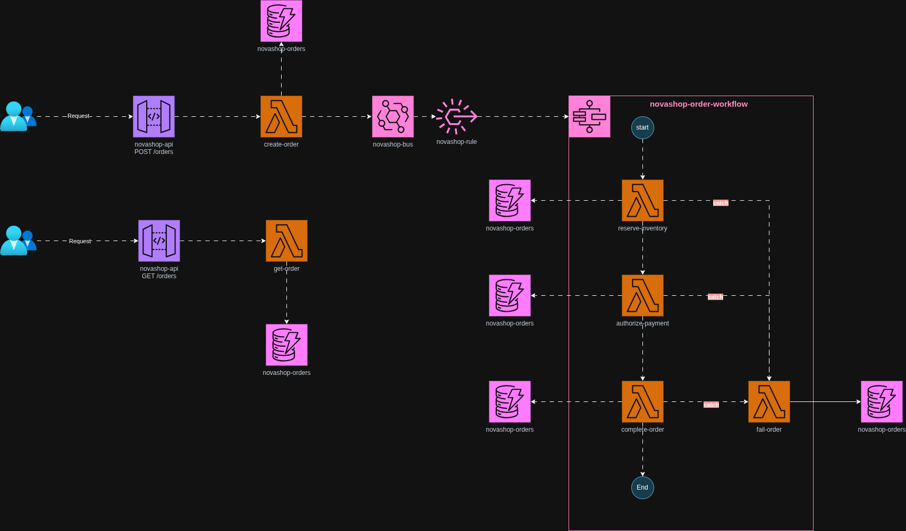

# NovaShop — Order Processing Backend (AWS Serverless)

NovaShop is a fictional online store that sells mechanical keyboards, wireless headsets, webcams, monitors, and home office accessories. Its business depends on digital campaigns and flash sales with sharp traffic spikes.

This repository contains the Lambda function code for a serverless order processing backend built on AWS.

---

## Architecture



The system handles two public endpoints and an asynchronous processing workflow:

**POST /orders** — A client submits an order. `create-order` validates the input, persists the order in DynamoDB with status `RECEIVED`, and publishes an `OrderSubmitted` event to EventBridge. The API responds immediately with `202 Accepted` without waiting for the order to be fully processed.

**GET /orders/{orderId}** — `get-order` reads the current order state from DynamoDB and returns it directly.

**Async workflow** — EventBridge routes `OrderSubmitted` to a Step Functions state machine (`novashop-order-workflow`) that orchestrates three sequential steps:

1. `reserve-inventory` — reserves stock and updates the order to `INVENTORY_RESERVED`
2. `authorize-payment` — authorizes the payment and updates the order to `PAYMENT_AUTHORIZED`
3. `complete-order` — finalizes the order, sets it to `COMPLETED`, and publishes `OrderCompleted`

If any step fails, Step Functions catches the error and invokes `fail-order`, which sets the order to `FAILED` and publishes `OrderFailed`.

### AWS services used

| Service | Role |
|---|---|
| API Gateway | Exposes `POST /orders` and `GET /orders/{orderId}` |
| Lambda | Business logic for each processing step |
| DynamoDB | Order state persistence (`novashop-orders` table) |
| EventBridge | Event bus that decouples `create-order` from the workflow |
| Step Functions | Orchestrates the multi-step processing flow |

---

## Order states

```
RECEIVED → INVENTORY_RESERVED → PAYMENT_AUTHORIZED → COMPLETED
                                                    ↘ FAILED
```

---

## Repository structure

```
novashop-aws-serverless/
├── src/
│   ├── shared/
│   │   ├── aws-clients.js          # DynamoDB and EventBridge client setup
│   │   ├── http.js                 # HTTP response helpers
│   │   ├── orders-repository.js    # DynamoDB read/write operations
│   │   └── publish-domain-event.js # EventBridge PutEvents wrapper
│   └── functions/
│       ├── create-order/app.js
│       ├── get-order/app.js
│       ├── reserve-inventory/app.js
│       ├── authorize-payment/app.js
│       ├── complete-order/app.js
│       └── fail-order/app.js
├── docs/
│   └── diagramv1.png
├── deploy.sh
└── package.json
```

---

## How it was built

All AWS resources were created manually. No IaC tool was used in this phase.

**Resources created manually:**
- DynamoDB table `novashop-orders`
- Six Lambda functions with individual IAM roles
- EventBridge custom event bus and routing rule
- Step Functions state machine
- API Gateway with two routes

**IAM permissions** were assigned using AWS managed policies (`AmazonDynamoDBFullAccess`, `AmazonEventBridgeFullAccess`) for simplicity. Least-privilege policies are a known improvement for future phases.

**Build and deploy** are handled by a local script:

```bash
npm install       # install dependencies
npm run build     # bundle each Lambda with esbuild
npm run zip       # package each Lambda into a .zip
./deploy.sh       # upload each .zip to AWS via aws lambda update-function-code
```

The script updates existing Lambda function code only. It does not create or modify infrastructure.

---

## Known limitations in this phase

The processing steps (`reserve-inventory`, `authorize-payment`) are stubs — they update the order state in DynamoDB but do not integrate with real inventory or payment systems. The following are intentional simplifications for this phase:

- `totalAmount` is accepted from the client without server-side price validation
- No product catalog exists; SKU validation is not performed
- Inventory reservation and payment authorization do not call external systems
- No saga compensation: if payment fails, the inventory reservation is not released
- `simulateInventoryFailure` and `simulatePaymentFailure` flags travel in the order payload as a development shortcut

---

## Planned improvements

- **IaC:** migrate infrastructure definition to Terraform
- **Real inventory:** add a `inventory` table in DynamoDB; `reserve-inventory` performs a conditional update that fails when stock is insufficient
- **Payment integration:** call an external payment gateway (Stripe / Culqi) from `authorize-payment`
- **Saga compensation:** add a `release-inventory` step to the failure path in Step Functions
- **Least-privilege IAM:** replace managed policies with resource-specific permissions per Lambda
- **Observability:** structured logging, X-Ray tracing, and CloudWatch alarms
- **CI/CD:** GitHub Actions pipeline to replace the manual deploy script
- **Intermediate events:** publish `InventoryReserved` and `PaymentAuthorized` to EventBridge
